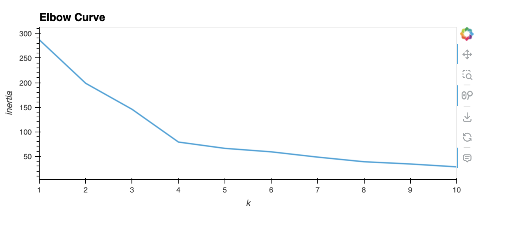

# Crypto Clustering

## Overview
The Crypto Clustering project aims to predict if cryptocurrencies are affected by 24-hour or 7-day price changes using unsupervised learning techniques, specifically K-means clustering. Additionally, the project explores the impact of dimensionality reduction using Principal Component Analysis (PCA) on clustering.

## Steps

1. Load and preprocess the data.
2. Scale the data using StandardScaler.
3. Find the best value for k using the elbow method.
4. Cluster cryptocurrencies with K-means using the original scaled data.
5. Perform PCA to reduce the features to three principal components.
6. Find the best value for k using the PCA data.
7. Cluster cryptocurrencies with K-means using the PCA data.
8. Visualize and compare the results using hvPlot.

## Results

1. Elbow curve for the original data.
Best value for k = 4

2. Elbow curve for the PCA data.
The best k value found using the PCA data seems to be the same 4  as the best k value found using the original data.

3. Scatter plot of cryptocurrency clusters based on the original data.

4. Scatter plot of cryptocurrency clusters based on the PCA data.

## Conclusion

The project analyzes the impact of using fewer features on clustering the data using K-means. Comparing the clustering results of the original data and the PCA data helps to understand the effect of dimensionality reduction on the clustering process.
